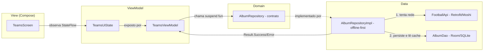

# Copa26 Álbum Digital

Aplicativo Android nativo (Kotlin + Jetpack Compose) de **álbum de figurinhas digital**
da Copa 2026, desenvolvido para a disciplina **FACOM32503 — Processo de Desenvolvimento
Mobile (PDM)**.

## Stack e Requisitos

- **Linguagem:** Kotlin
- **UI:** Jetpack Compose (Material 3)
- **Arquitetura:** MVVM (Model–View–ViewModel)
- **Build:** Gradle (Kotlin DSL) + version catalog (`gradle/libs.versions.toml`)
- **SDK:** `minSdk = 24`, `targetSdk`/`compileSdk = 36`, `JavaVersion.VERSION_11`

## Configuração de `local.properties`

O app consome dados reais da API [football-data.org](https://www.football-data.org) e,
opcionalmente, de uma API privada de fotos (`photo-api/`). Ambas exigem chaves que **não**
são versionadas — cada dev cria seu próprio `local.properties` na raiz do projeto:

```bash
cp local.properties.example local.properties
# edite local.properties e preencha FOOTBALL_API_TOKEN com seu token
```

- `FOOTBALL_API_TOKEN`: obrigatório. Sem ele (ou com um token inválido), toda chamada à
  football-data.org falha e a tela de equipes exibe erro de "competição não encontrada" —
  crie uma conta gratuita em https://www.football-data.org/client/register para gerar o seu.
  Validado em 2026-07-28: com um token válido, `GET /v4/competitions/WC/teams` e
  `GET /v4/teams/{id}` retornam `squad` e `coach` inline mesmo no plano gratuito — o app
  carrega os 48 times, elenco (26 jogadores) e técnico de cada seleção normalmente.
  O plano gratuito limita a **10 requisições/minuto** (header `X-Requests-Available-Minute`);
  navegação muito rápida entre telas pode esbarrar nisso.
- `PHOTO_API_BASE_URL` / `PHOTO_API_KEY`: só necessários se for rodar a `photo-api/` local
  (ver `photo-api/README.md`); já vêm com padrão para o emulador Android.

## Como compilar e executar

Pré-requisitos: Android Studio (recomendado) ou JDK 11 + Android SDK configurados.

```bash
# Clonar
git clone https://github.com/facom32503-album-copa26/copa26-album-digital.git
cd copa26-album-digital

# Build de debug
./gradlew assembleDebug

# Testes unitários
./gradlew testDebugUnitTest

# Testes instrumentados (emulador/dispositivo conectado)
./gradlew connectedAndroidTest

# Bundle de release para publicação (AAB)
./gradlew bundleRelease
```

Para rodar no emulador/dispositivo, abra o projeto no Android Studio e use **Run ▶**,
ou instale o APK de debug gerado em `app/build/outputs/apk/debug/`.

## Estrutura do Projeto

O código segue a arquitetura **MVVM** com separação clara em camadas
(`data` → `domain` → `ui`):

```
app/src/main/java/com/example/copa26_album_digital/
├── MainActivity.kt                # Ponto de entrada + NavHost (Navigation Compose)
├── data/
│   ├── remote/                    # Camada de rede (Retrofit + Moshi)
│   │   ├── FootballApi.kt         # Interface dos endpoints football-data.org
│   │   ├── AuthInterceptor.kt     # Injeta o header X-Auth-Token
│   │   └── dto/                   # DTOs de request/response (Moshi)
│   ├── local/                     # Cache offline (Room)
│   │   ├── dao/AlbumDao.kt        # Operações de leitura/escrita
│   │   ├── entity/                # Entidades persistidas (competitions, teams, players…)
│   │   └── SquadSeed.kt           # Fallback de elenco/treinador (plano gratuito)
│   ├── mapper/TeamMapper.kt       # DTO → entidade → modelo de domínio
│   └── repository/                # AlbumRepositoryImpl (offline-first)
├── domain/
│   ├── model/                     # Modelos de domínio (Competition, Team, Player…)
│   ├── repository/AlbumRepository.kt  # Contrato consumido pelos ViewModels
│   └── util/Result.kt             # Envólucro Success/Error
└── ui/
    ├── teams/                     # TeamsScreen + TeamsViewModel + TeamsUiState
    ├── team/                      # TeamScreen + TeamViewModel
    ├── person/                    # PlayerDetailScreen + PersonViewModel
    └── theme/                     # Tema Material 3 (Theme.kt, Color.kt, Type.kt)
app/src/test/java/…                # Testes unitários (JUnit + MockK + coroutines-test)
app/src/main/res/                  # Recursos (drawable, values/strings.xml, etc.)
gradle/libs.versions.toml          # Version catalog (todas as dependências)
.github/instructions/              # Diretrizes de desenvolvimento (MVVM, Compose, etc.)
```

## Fluxo de Dados (MVVM)

O app implementa **MVVM** com um repositório **offline-first**. A View (Compose) é
"burra": apenas observa estado e emite eventos; toda a lógica vive no `ViewModel` e no
repositório. O fluxo entre as camadas é sempre **unidirecional**:



**Passo a passo (tela de equipes):**

1. **View** — `TeamsScreen` coleta `viewModel.uiState` (um `StateFlow<TeamsUiState>`) e
   renderiza *loading*, a grade de equipes ou a mensagem de erro.
2. **ViewModel** — `TeamsViewModel.load()` roda em `viewModelScope` e chama
   `repository.getCompetition("WC")`, atualizando o `TeamsUiState` conforme o resultado.
3. **Domain** — o ViewModel só conhece a interface `AlbumRepository` e o `Result`
   (`Success`/`Error`), sem detalhes de rede ou banco.
4. **Data** — `AlbumRepositoryImpl` executa a estratégia **offline-first**: tenta
   sincronizar com a `FootballApi` (Retrofit) e grava no cache Room (`AlbumDao`); se a rede
   falhar, recai sobre os dados persistidos, garantindo que a UI sempre receba dados quando
   houver cache. Os DTOs são convertidos em entidades e modelos de domínio por `TeamMapper`.

Esse desacoplamento é o que permite testar cada camada isoladamente (ver seção **Testes**).

## Integração de Dados

Os dados vêm da **API REST pública [football-data.org](https://www.football-data.org)**
(v4), consumida via **Retrofit + Moshi**. A autenticação é feita por um header
`X-Auth-Token` injetado automaticamente pelo `AuthInterceptor` (o token vem do
`BuildConfig`, nunca hardcoded). As imagens são servidas por uma **API privada de fotos**
(`photo-api/`) protegida por chave.

### Endpoints consumidos (`FootballApi`)

| Método | Endpoint | Uso no app |
| --- | --- | --- |
| `getCompetition` | `GET /v4/competitions/WC` | Metadados da Copa (nome, edição, emblema) |
| `getCompetitionTeams` | `GET /v4/competitions/WC/teams` | As 48 seleções participantes |
| `getTeam` | `GET /v4/teams/{id}` | Detalhe da seleção + elenco |
| `getScorers` | `GET /v4/competitions/WC/scorers?limit=100` | Estatísticas (jogos/gols/assistências) |

### Exemplo de requisição

```bash
curl -H "X-Auth-Token: <FOOTBALL_API_TOKEN>" \
  https://api.football-data.org/v4/competitions/WC/scorers?limit=100
```

### Exemplo de resposta (recortada)

```json
{
  "scorers": [
    {
      "player": { "id": 3218, "name": "Lionel Messi", "position": "Offence" },
      "team": { "id": 762, "name": "Argentina" },
      "playedMatches": 8,
      "goals": 8,
      "assists": 4
    }
  ]
}
```

O `AlbumRepositoryImpl` casa esses artilheiros pelo `id` do jogador e enriquece o elenco
com as estatísticas reais; jogadores fora do ranking (o plano gratuito cobre ~100
artilheiros) permanecem com estatísticas zeradas em vez de quebrar a sincronização.
Os títulos de Copa exibidos nos escudos vêm de um **mapa fixo por seleção** (dados
históricos), não da API — Brasil 5×, Alemanha 4×, Argentina 3×, etc.

## Testes

O projeto possui **testes unitários funcionais** (JUnit 4 + MockK + `coroutines-test`)
cobrindo as três camadas do MVVM. Execute com:

```bash
./gradlew testDebugUnitTest
```

| Arquivo | Camada | O que valida |
| --- | --- | --- |
| `TeamMapperTest` | Data (mapper) | Mapa fixo de títulos por seleção; enriquecimento de estatísticas; parsing de cores |
| `AlbumRepositoryImplTest` | Data (repositório) | Estratégia offline-first (cache × erro) e enriquecimento pelos artilheiros |
| `TeamsViewModelTest` | UI (ViewModel) | Projeção de `Result` do repositório no `TeamsUiState` (sucesso e erro) |

## Convenções de Código


As regras de desenvolvimento estão documentadas em `.github/instructions/` e devem ser
seguidas obrigatoriamente. Resumo:

- MVVM: lógica de negócio no `ViewModel` (via `StateFlow`); View "burra".
- Composables em PascalCase e substantivos, puros, com `modifier: Modifier = Modifier`.
- SP para fontes, DP para dimensões; listas em `LazyColumn`.
- Textos em `res/values/strings.xml`; imagens decorativas com `contentDescription = null`.
- Dependências apenas via `libs.versions.toml` (nunca versões hardcoded).

## Fluxo de Trabalho da Equipe (Git)

- **Repositório compartilhado** na organização `facom32503-album-copa26`.
- **Branches por membro/feature**: ninguém commita direto na `main`.
- **Pull Requests obrigatórios**, revisados pelo **Líder do Projeto** antes do merge.
- **Gestão de tarefas** via **GitHub Projects**.
- Manter este **README** sempre atualizado com instruções de compilação e uso.

### Padrão de branches

```
main                  # protegida, só recebe merge via PR aprovado
feature/<descricao>   # novas funcionalidades
fix/<descricao>       # correções
```

## Equipe

Projeto em grupo (até 8 integrantes) com papéis definidos: Líder do Projeto,
Desenvolvedores Android, Engenheiros de Dados e Designers/UX.

Disciplina ministrada pelo **Prof. Cláudio C. Rodrigues** — UFU/BSI.

